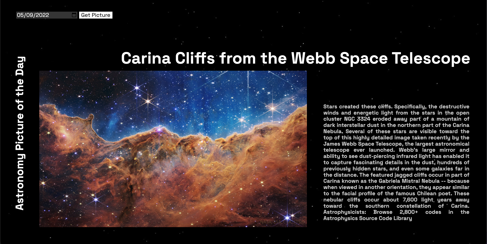

# Description

A simple website using the NASA API 'Astronomy Picture of the Day'.

Website: <a href="https://astronomy-photo.netlify.app" targer="_blank">Astronomy Picture of the Day</a>
--

# Features

- HTML, CSS and JavaScript
- Fully Responsive

--

# Setup

- Get the code:
- git clone https://github.com/ggmaribel/NASA-API.git
